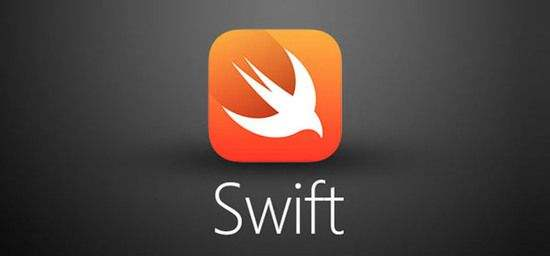

## 图科大 iOS开发

	

## 2018.05.27

* [UCAS-PPT目录](https://github.com/uwuneng/swift_Lib/tree/master/PPT)
* [UCAS-lesson2](https://github.com/uwuneng/swift_Lib/tree/master/UCAS_02)

## 2018.05.20

* [UCAS_iOS](https://github.com/uwuneng/swift_Lib)

## 2018.03.14

1. 方法嵌套；
2. 全名空间；
3. typealias；
4. associatedtype；

